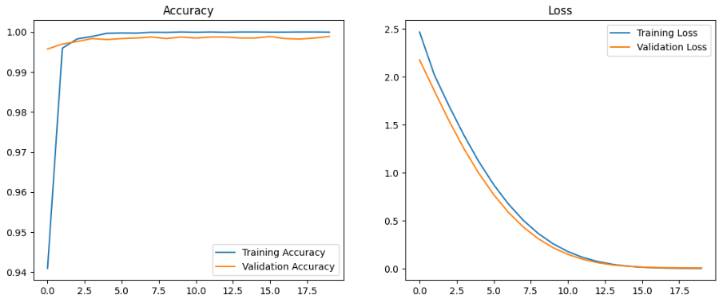
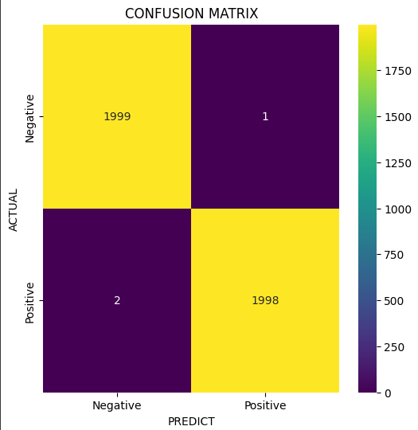
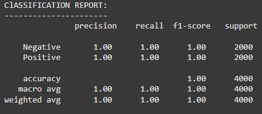
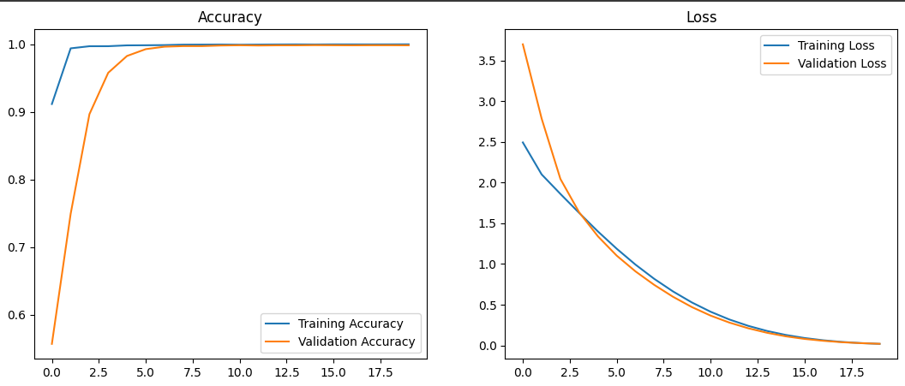
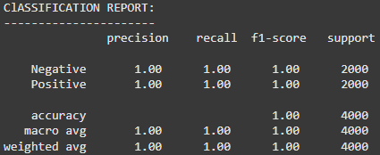

# Cracking Concrete Detection

## About This Repo 🌟
<p align="justify">
Sebuah project praktikum yang memiliki tujuan untuk melakukan deteksi crack atau tidaknya sebuah beton. Model yang digunakan untuk melakukan pendeteksian ini adalah InceptionV3 dan MobileNetV3
</p>

---

## Dataset 📂
<p align="justify">
Project ini Menggunakan dataset dari kaggle berikut ini:
   
[Surface Crack Detection](https://www.kaggle.com/datasets/arunrk7/surface-crack-detection)
</p>

---

## Pre-trained Models 🧠

<p align="justify">
Menggunakan Pre-train Model:
</p>

- **InceptionV3**:

| Model         | Size (MB) | Top-1 Accuracy | Top-5 Accuracy | Parameters | Depth | Time (ms) per inference step (CPU) | Time (ms) per inference step (GPU) |
|---------------|-----------|----------------|----------------|------------|-------|-------------------------------------|-------------------------------------|
| InceptionV3   | 92        | 77.9%          | 93.7%          | 23.9M      | 189   | 42.2                                | 6.9                                 |

<p align="justify">
Loss and Accuracy
</p>



<p align="justify">
Confusion Matrix
</p>



<p align="justify">
Classification Report
</p>



---

- **MobileNetV3**:

| Model         | Size (MB) | Top-1 Accuracy | Top-5 Accuracy | Parameters | Depth | Time (ms) per inference step (CPU) | Time (ms) per inference step (GPU) |
|---------------|-----------|----------------|----------------|------------|-------|-------------------------------------|-------------------------------------|
| MobileNetV2   | 14        | 71.3%          | 90.1%          | 3.5M       | 105   | 25.9                                | 3.8                                 |

<p align="justify">
Loss and Accuracy
</p>



<p align="justify">
Confusion Matrix
</p>


<p align="justify">
Classification Report
</p>



---

## Testing 🧪

Jalankan Streamlit dengan

```
   streamlit run code/prak6ml.py
```

1. **Library Setup:**
   - Tensorflow.
   - Streamlit.
   - Numpy.
   - Pathlib.

2. **Test Uploaded Image Prediction:**

   - Upload Gambar.
   - Select model (MobilenetV2 / InceptionV3).
   - Click "Predict" dan Cek Hasil.

3. **Download Model**
   https://drive.google.com/drive/folders/1NkXdmjIdPDN-hdYwG4iwgrSkM_i7vitL?usp=sharing
---

## Contributing 🤝

<p align="justify">
Contributions are welcome! Please create a pull request for any enhancements or bug fixes.
</p>

---
